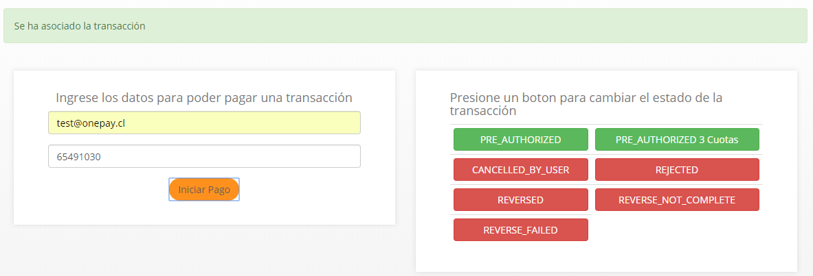

# Proyecto de ejemplo para Transbank SDK .Net
Proyecto de ejemplo para el SDK de Transbank Onepay, usando .Net Framework 4.6 y MVC5

## Requerimientos
Para poder ejecutar el proyecto de ejemplo necesitas [tener instalado Visual Studio 2017](https://visualstudio.microsoft.com/es/downloads/).

De preferencia debes tener instalado el componente para desarrollo con ASP.NET y WEB. De lo contrario, Visual Studio te guiara por el proceso para agregar este componente a tu instalación, solo debes seguir los pasos que veas en la pantalla.

## Construir
1. Abrir la solución `TransbankOnepayTest.sln` con Visual Studio
2. Hacer clic derecho sobre el proyecto `OnepayMVCTest`.
3. Seleccionar la opción `Establecer como proyecto de inicio`.
4. Clic derecho nuevamente sobre el proyecto `OnepayMVCTest` y seleccionar la opción `Compilar`.

## Ejecutar ejemplo
Iniciar la aplicación (`ctrl + F5`)  `Menú` -> `Debug` -> `Iniciar sin debug`

Si todo ha salido bien deberías abrirse tu navegador y mostrar el ejemplo en la URL 
http://localhost:58383/

## Compra de prueba
1. Clic en el botón `Pagar con Onepay`
2. Esperar a que se genere un nuevo código QR.
3. Utilizando un lector de QR o directamente desde la consola de JS, puedes copiar el OCC (identificador simplificado y único de la transacción) que se utiliza en el simulador de pago.
4. Pagar/Rechazar utilizando el simulador de pagos

## Simulador de pagos.
Este simulador permite realizar pruebas de **pagos** y **rechazos** con distintos códigos, simulando las acciones del usuario en la aplicación de **Onepay**. 

Este simulador apunta al ambiente de Prueba que puede ser configurado siguiendo las instrucciones provistas en tu SDK/Plugin

1. La URL es: https://onepay.ionix.cl/mobile-payment-emulator/

2. Una vez te registres como comercio con Transbank, tendrás tus propios datos de prueba, sin embargo, si quieres comenzar a probar antes, puedes usar el email `test@onepay.cl`

3. En el código de compra, debes introducir el número de OCC (el cual es un número único por transacción y se genera al momento de crear una nueva transacción)

4. Al momento de presionar el botón `Iniciar Pago` veras que el QR de tu comercio reacciona y queda esperando la respuesta del pago.

5. En este punto, puedes seleccionar alguna de las opciones disponibles, para cambiar el estado de la transacción en Transbank.
    - **PRE_AUTHORIZED**: Pago normal, sin cuotas.
    - **PRE_AUTHORIZED 3 Cuotas**: Pago en 3 Cuotas.
    - **CANCELED_BY_USER**: Transacción cancelada por el usuario.
    - **REJECTED**: Transacción rechazada.
    - **REVERSED**: Transacción reversada.
    - **REVERSE_NOT_COMPLETE**: Reversa de transacción incompleta.
    - **REVERSE_FAILED**: Reversa de transacción con error.

6. Las respuestas **PRE_AUTHORIZED** y **PRE_AUTHORIZED 3 Cuotas** terminaran el flujo simulando un pago exitoso por parte del usuario.

7. Al terminar el pago exitosamente, serás redirigido en tu aplicación al detalle de la compra realizada.
